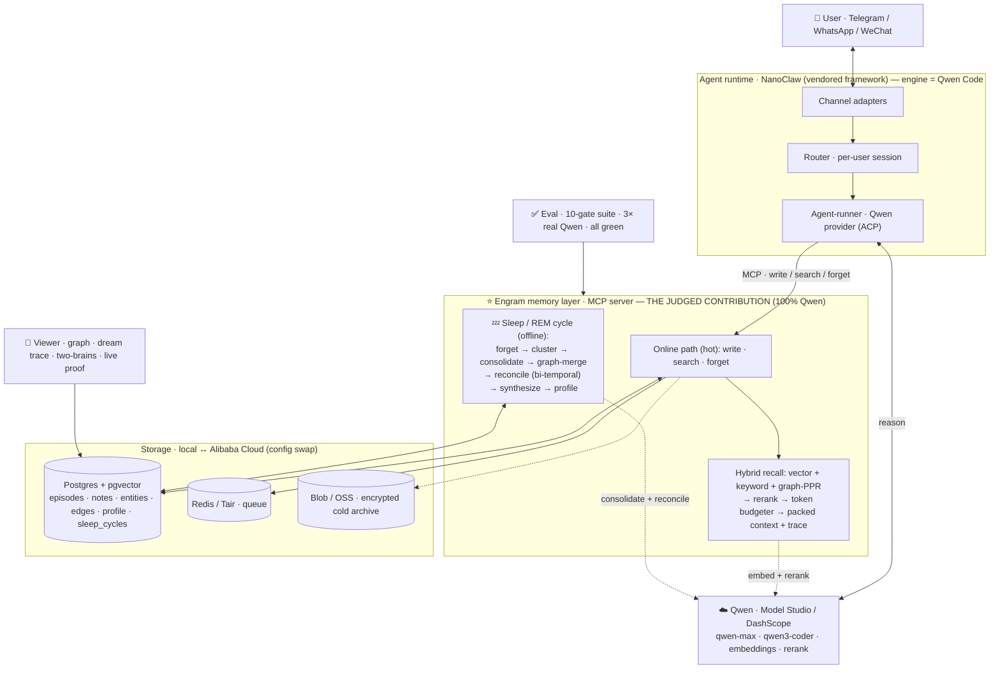

# Engram Architecture

Engram is a cloud-hosted personal agent reached over Telegram / WhatsApp / WeChat,
reasoning on Qwen, built around a **self-managing cloud memory layer** whose **sleep
phase** consolidates, forgets, reconciles, and connects memories during downtime. The
agent is the vehicle; the memory layer is the hero — a separable MCP service, so it drops
into any agent.

## System diagram

### Rendered (Mermaid)



### Detail (ASCII)

```
 CHANNELS                AGENT RUNTIME (nanoclaw)            MEMORY (the hero, MCP)
 ┌──────────┐  webhook   ┌───────────────────────┐          ┌────────────────────────┐
 │ Telegram │──poll────▶ │ router → per-session   │          │ memory MCP server      │
 │ WhatsApp │──────────▶ │ container (Bun)        │  MCP     │  memory.write          │
 │ WeChat   │──────────▶ │   engine = QWEN CODE   │─stdio──▶ │  memory.search (+pack) │
 │ [mock]   │  (eval)    │   (ACP daemon)         │          │  memory.forget         │
 └──────────┘            └───────────┬───────────┘          └───────────┬────────────┘
                                     │ tenant_id env                    │ core lib (direct)
                                     ▼                                  ▼
                          ┌─────────────────────────────────────────────────────────┐
                          │ packages/shared — infra interfaces                       │
                          │ Store · Vector · Blob · Queue · Scheduler · Secrets       │
                          │ QwenClient (DashScope, behind interface + offline mock)   │
                          └───────────────┬─────────────────────────────────────────┘
                ┌──────────────────────────┴───────────────────┐
                ▼ online (fast, cheap)                          ▼ offline (scheduled)
   ┌──────────────────────────┐                  ┌──────────────────────────────────┐
   │ write+embed, dedup, DLQ   │                  │ SLEEP / REM CYCLE                 │
   │ hybrid recall → rerank →  │                  │ cluster→consolidate→graph-merge→  │
   │ context budgeter (trace)  │                  │ forget→reconcile→synthesize       │
   └──────────────────────────┘                  │ checkpointed · cost-bounded ·     │
                                                  │ observable (cycle report)         │
                                                  └──────────────────────────────────┘

 local stack   :  Postgres+pgvector (5433) · Redis (6380) · MinIO (9000)
 alibaba (swap):  AnalyticDB for PostgreSQL · Tair · OSS · FunctionCompute+EventBridge
```

## The two memory paths

**Online (real-time, fast & cheap)** — `memory.write` does lightweight episodic capture
plus embedding with content-hash dedup; `memory.search` runs hybrid recall (vector ANN +
keyword + one hop of graph), reranks, then the **context budgeter** packs candidates under
a token budget scoring `w1·relevance + w2·recency_decay + w3·importance + w4·diversity`
and returns the packing trace. `memory.forget` is explicit. All heavy cognition is
deferred to the sleep phase.

**Sleep phase / REM cycle (offline, during downtime)** — per-user, triggered by
inactivity or a nightly schedule (whichever first), or forced for a demo. Steps:
1. cluster recent active episodes (embedding cosine-kNN)
2. consolidate each cluster into a durable semantic note (Qwen-Max)
3. merge entities/edges into the personal knowledge graph (Qwen-Turbo extraction)
4. forgetting/decay sweep (archive/forget low-value, unaccessed episodes)
5. batch contradiction reconciliation (flag overlaps, resolve, supersede stale notes)
6. cross-cluster synthesis (surface new connections that didn't exist before)
7. checkpoint after each step; enforce per-tenant cost cap; emit an observable report.

## Memory v2 (research-backed — `docs/memory-research-summary.md`)
- **Multi-hop retrieval:** Personalized PageRank over the entity graph (HippoRAG) is a
  recall source feeding rerank + budgeter, seeded by query entities (no online LLM call);
  1-hop fallback for tiny graphs.
- **Bi-temporal + invalidation (Zep/Graphiti):** notes/edges carry valid + transaction time;
  contradictions invalidate (preserved for "as of T" reads), recorded as Mem0-style
  ADD/UPDATE/DELETE/NOOP ops. The validity filter is centralized so no read leaks stale memory.
- **Core memory blocks (MemGPT/Letta + LLM-wiki):** a bounded, human-readable per-tenant
  profile maintained by the sleep phase; `memory.search` prepends it cheaply.
- **Importance + reflection (Generative Agents):** LLM-rated 1-10 importance; min-max
  normalized budgeter; sleep fires on accumulated importance, not just inactivity/cron.

## Memory viewer (brain UI)
`packages/viewer` — a tenant-scoped JSON API over `MemoryRepo` + `MemoryService` and a
React/Vite neural-graph UI on one port (`http://localhost:8080`). Entities = neurons,
edges = synapses (invalidated ones grey out); recall lights up activated neurons and shows
the budgeter's per-candidate packing trace; sleep cycles show before→after consolidation
with a step-by-step dream trace. For the demo it adds:
- **▶ Demo Mode** — a self-running arc: teach → ask → dream → update a fact → dream → ask
  again (answers the new value, old gone).
- **Ask both brains** — the same question answered *with* Engram memory vs a no-memory model.
- **Teach Engram** — type a fact and watch it get remembered.
- **Proof panel** — the eval gate results (3× real Qwen) live in the UI.

## Data model
See `packages/memory/src/db/migrations/`. Tables: `tenants`, `episodes`,
`semantic_notes` (+ bi-temporal cols + importance), `entities`, `edges` (+ bi-temporal),
`contradictions`, `sleep_cycles` (stats incl. memoryOps), `core_memory`, `queue_items`.

## Local ↔ Cloud
Everything is behind `packages/shared` interfaces selected by `ENGRAM_INFRA`. No
hardcoded cloud endpoints; deploying to Alibaba is a config swap. See `deploy/alibaba/`.

## Multi-tenancy & isolation
One isolated agent container per session (nanoclaw). Memory is scoped per tenant
(`tenant_id` = the owner user id) on every query; content is encrypted at rest. The
sleep phase is isolated and cost-bounded per tenant so one user's cycle can't starve
others.
