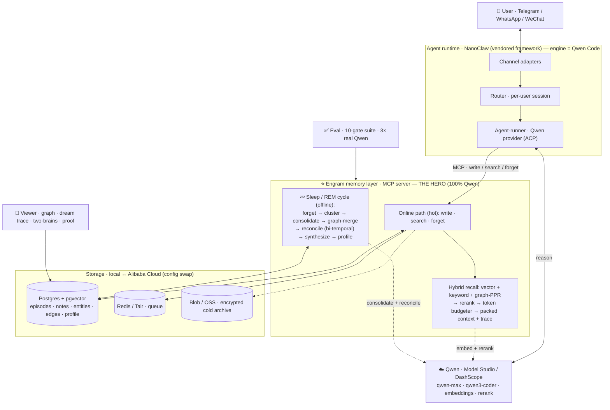

# Engram

**A self-managing memory layer for AI agents — built on Qwen.** Engram captures and
recalls fast while you're active, and during downtime runs a **sleep / REM cycle** that
consolidates raw episodes into durable knowledge, forgets the stale, reconciles
contradictions, and synthesizes new connections — the way sleep consolidates memory in the
brain.

The memory layer is a clean, separable **MCP service**. A Qwen agent (Telegram / WhatsApp)
is the vehicle that shows it off.

> Qwen Cloud Hackathon · Track 1 (MemoryAgent) · MIT

## See it in 60 seconds

```bash
pnpm --filter @engram/viewer start      # brain viewer → http://localhost:8080
```

Hit **▶ Demo**. It self-runs the whole story, no driving needed: teach 3 facts → **Ask
both brains** (Engram answers from memory, a no-memory model shrugs) → 💤 **Dream** (the
graph consolidates) → change a fact → Dream again → ask again: it answers the **new** value,
the old one gone. Or use **Teach Engram** to feed it your own facts and watch.

**Proof** — the memory layer passes a **10-gate eval, 3× on real Qwen, all green**: recall,
*timely forgetting*, *limited-context recall*, contradiction/update resolution, RAG,
no-confabulation, ~200 ms p95. The numbers show live in the viewer's **Proof** panel, or:

```bash
QWEN_MOCK=false DASHSCOPE_API_KEY=sk-... EVAL_RUNS=3 pnpm --filter @engram/eval evals
```

## What's here

```
packages/memory/   ← the hero: memory MCP server (online path) + sleep/REM cycle
packages/shared/   ← infra interfaces + Qwen client (DashScope, behind an interface + offline mock)
packages/viewer/   ← brain viewer: read-only API + React neural-graph UI (Demo Mode, two-brains, proof)
packages/eval/     ← gated eval suite (recall · forgetting · limited-context · contradiction · RAG)
nanoclaw-v2/       ← agent runtime: vendored NanoClaw framework, engine = Qwen Code
deploy/alibaba/    ← config-swap deploy to Alibaba Cloud
```

## The two memory paths

- **Online (fast, cheap):** `memory.write` (episodic capture + embed, idempotent),
  `memory.search` (hybrid recall — vector + keyword + graph-PPR → rerank → a **token
  budgeter** that packs under a budget and exposes its packing trace), `memory.forget`.
- **Sleep / REM (offline, per user):** forget-sweep → cluster → consolidate to semantic
  notes → merge a knowledge graph → reconcile contradictions (bi-temporal) → synthesize →
  rewrite the profile. Checkpointed, cost-bounded, and observable (each cycle emits a report).

Research basis (HippoRAG PPR, Zep/Graphiti bi-temporal, MemGPT/Letta core memory,
Generative-Agents importance): `docs/memory-research-summary.md`.

## Run it

```bash
./engram.sh          # boot docker + build + start the viewer + open the browser
./engram.sh eval     # run the eval, print the report
./engram.sh dream    # force a sleep/REM cycle now
./engram.sh agent    # set up the Telegram / WhatsApp agent (guided)
./engram.sh down     # stop everything (data preserved)
```

Runs offline on a deterministic **mock Qwen** until you add a key. Turn on real Qwen: set
`DASHSCOPE_API_KEY` and `QWEN_MOCK=false` in `.env` (the Qwen client is behind an interface,
so inference + embeddings behave identically local and cloud).

The agent half (`./engram.sh agent`) builds on the vendored NanoClaw runtime (Telegram +
WhatsApp adapters, per-session containers) with the engine on **Qwen Code** and Engram
memory attached over MCP. Full runbook: `docs/agent-and-deploy.md`.

## Deploy to Alibaba

Infra is behind `packages/shared` interfaces — deploying is a config swap
(`ENGRAM_INFRA=alibaba`): AnalyticDB for PostgreSQL, Tair, OSS, Function Compute +
EventBridge (sleep schedule). See `deploy/alibaba/`.

## Architecture



Full detail — data model, security, multi-tenancy — in `ARCHITECTURE.md`.
Test plan + eval gates in `TESTING.md`.

## How it works (in depth)

Engram splits memory into a **fast online path** (runs on every message, cheap) and a
**slow offline "sleep" path** (batches the expensive thinking) — the same split a brain uses.

### 1. Capture — writing a memory
Every message becomes an **episode**: the raw text, a vector embedding (Qwen), a content
hash for deduplication, an importance score, the source channel, and timestamps. Writes are
idempotent — the same fact twice doesn't pile up. Capture stays deliberately dumb and fast;
all the real cognition is deferred to sleep.
> *Like jotting the day's events in a notebook. Each entry also gets a "fingerprint" so the
> system can find it later even if you ask in completely different words.*

### 2. Recall — finding the right memories
A query runs three searches at once, then ranks and trims the results:
- **Semantic (vector):** finds memories that *mean* the same thing, even with different wording.
- **Keyword (full-text):** catches exact tokens semantics miss — a phone number, a date, a name.
- **Graph (Personalized PageRank):** starts from the entities in your question and spreads
  outward through the knowledge graph, pulling in connected facts (the HippoRAG idea —
  multi-hop "one thing reminds you of another").

Those candidates are **reranked** (a Qwen reranker sharpens relevance), then a **token
budgeter** packs only the most useful few into the limited window the model can read —
scoring each by relevance, recency, importance, and diversity, and exposing its reasoning
(the packing trace you see in the viewer).
> *Like answering from memory: one thought sparks a related one (the graph), you weigh which
> memories actually matter, and since you can only hold a handful in your head at once, you
> keep the best and drop the rest.*

### 3. The sleep / REM cycle — the hero
While you're idle (or on a schedule), Engram "sleeps" and reorganizes its memory in seven
checkpointed, cost-bounded steps:
1. **Forget** — decays stale, low-value, never-recalled episodes (run *first*, so junk never
   gets baked into durable memory).
2. **Cluster** — groups related recent episodes by similarity.
3. **Consolidate** — turns each cluster into one durable **semantic note**, keeping the
   concrete details verbatim (numbers, dates, names).
4. **Graph-merge** — extracts entities and relationships from the new notes into a
   **knowledge graph** (people, places, things, and how they connect).
5. **Reconcile** — finds contradictory notes, decides which is current, and **supersedes** the
   stale one (without deleting it — see bi-temporal below).
6. **Synthesize** — surfaces non-obvious connections across notes that no single note stated.
7. **Profile** — rewrites a short, always-on summary of who you are, read first on every turn.
> *Like sleep in the brain: the day's raw experiences get sorted, the trivial fades, related
> memories fuse into lasting knowledge, conflicts resolve, and new connections form overnight
> — you wake up "knowing" more than you consciously stored.*

### 4. Updates & contradictions — bi-temporal memory
When a fact changes ("my flight moved to 8pm"), Engram doesn't overwrite the old note — it
marks the old one **invalidated** and links the new one as its successor. Every note carries
two timelines: when it was *true*, and when it was *recorded*. Recall only ever returns
currently-valid memories, but the full history is preserved, so the system could answer "what
did I believe last week?"
> *Like a ledger where you strike through an old entry instead of erasing it — today's balance
> is correct, but the history stays intact.*

### 5. The knowledge graph
Entities (people, places, projects) are nodes; relationships are edges, each with a weight
and the same valid/invalid timeline. It's stored as plain Postgres tables (not a graph
database) so it deploys anywhere. The graph powers multi-hop recall (the PageRank step) and
the brain visualization.
> *A web of who/what/where and how they connect — pull one thread and the related things
> come with it.*

### 6. Document RAG
Upload a document and it's chunked, embedded, and stored as durable reference notes the sleep
phase never forgets or rewrites. They join the same recall pool, so the agent can answer from
your files — and says "I don't know" when the file doesn't cover it.
> *A reference shelf the agent can quote from, kept separate from its day-to-day memories.*

### 7. Why trust it — the eval
Everything above is held to a 10-gate test suite, run 3× on real Qwen: it must recall
accurately, forget the stale, resolve updates to the *new* value, pull the right facts under
a tight context budget, answer from documents, and never make things up. All green
(`packages/eval`; results show live in the viewer's **Proof** panel).
> *A report card the system has to pass every run — so "it works" is a number, not a vibe.*

### Research lineage
Each piece above maps to a proven idea from recent memory research: **sleep-time compute**
(MemGPT/Letta), **graph PageRank retrieval** (HippoRAG), **bi-temporal contradiction
handling** (Zep/Graphiti), **importance-weighted recall** (Generative Agents), and **edit
operations** (Mem0). Full write-up with adversarially-verified sources:
`docs/memory-research-summary.md`.
