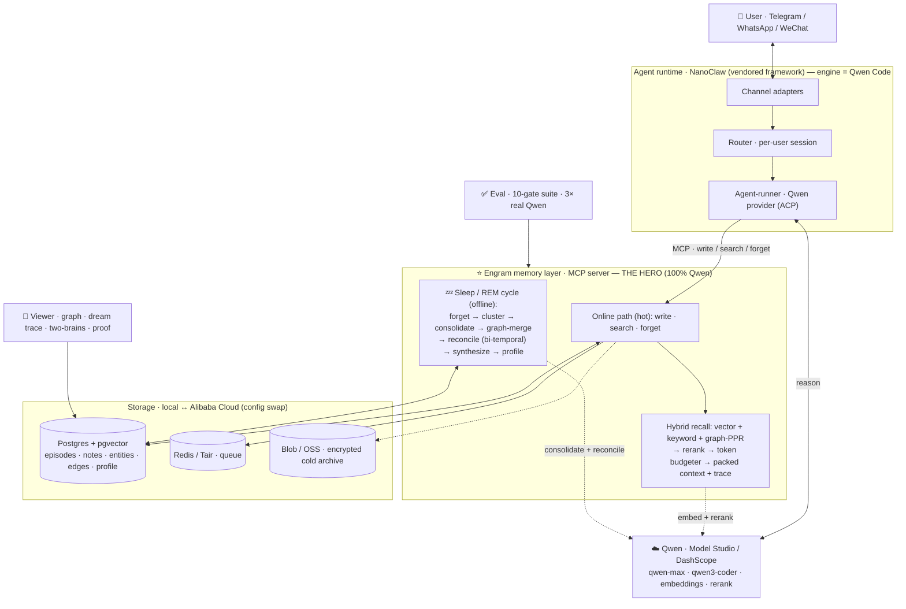

# Engram

**A self-managing memory layer for AI agents — built on Qwen.** Engram captures and
recalls fast while you're active, and during downtime runs a **sleep / REM cycle** that
consolidates raw episodes into durable knowledge, forgets the stale, reconciles
contradictions, and synthesizes new connections — the way sleep consolidates memory in the
brain.

The memory layer is a clean, separable **MCP service**. A Qwen agent (Telegram / WhatsApp)
is the vehicle that shows it off.

> Qwen Cloud Hackathon · Track 1 (MemoryAgent) · MIT

## See it in 60 seconds

```bash
pnpm --filter @engram/viewer start      # brain viewer → http://localhost:8080
```

Hit **▶ Demo**. It self-runs the whole story, no driving needed: teach 3 facts → **Ask
both brains** (Engram answers from memory, a no-memory model shrugs) → 💤 **Dream** (the
graph consolidates) → change a fact → Dream again → ask again: it answers the **new** value,
the old one gone. Or use **Teach Engram** to feed it your own facts and watch.

**Proof** — the memory layer passes a **10-gate eval, 3× on real Qwen, all green**: recall,
*timely forgetting*, *limited-context recall*, contradiction/update resolution, RAG,
no-confabulation, ~200 ms p95. The numbers show live in the viewer's **Proof** panel, or:

```bash
QWEN_MOCK=false DASHSCOPE_API_KEY=sk-... EVAL_RUNS=3 pnpm --filter @engram/eval evals
```

## What's here

```
packages/memory/   ← the hero: memory MCP server (online path) + sleep/REM cycle
packages/shared/   ← infra interfaces + Qwen client (DashScope, behind an interface + offline mock)
packages/viewer/   ← brain viewer: read-only API + React neural-graph UI (Demo Mode, two-brains, proof)
packages/eval/     ← gated eval suite (recall · forgetting · limited-context · contradiction · RAG)
nanoclaw-v2/       ← agent runtime: vendored NanoClaw framework, engine = Qwen Code
deploy/alibaba/    ← config-swap deploy to Alibaba Cloud
```

## The two memory paths

- **Online (fast, cheap):** `memory.write` (episodic capture + embed, idempotent),
  `memory.search` (hybrid recall — vector + keyword + graph-PPR → rerank → a **token
  budgeter** that packs under a budget and exposes its packing trace), `memory.forget`.
- **Sleep / REM (offline, per user):** forget-sweep → cluster → consolidate to semantic
  notes → merge a knowledge graph → reconcile contradictions (bi-temporal) → synthesize →
  rewrite the profile. Checkpointed, cost-bounded, and observable (each cycle emits a report).

Research basis (HippoRAG PPR, Zep/Graphiti bi-temporal, MemGPT/Letta core memory,
Generative-Agents importance): `docs/memory-research-summary.md`.

## Run it

```bash
./engram.sh          # boot docker + build + start the viewer + open the browser
./engram.sh eval     # run the eval, print the report
./engram.sh dream    # force a sleep/REM cycle now
./engram.sh agent    # set up the Telegram / WhatsApp agent (guided)
./engram.sh down     # stop everything (data preserved)
```

Runs offline on a deterministic **mock Qwen** until you add a key. Turn on real Qwen: set
`DASHSCOPE_API_KEY` and `QWEN_MOCK=false` in `.env` (the Qwen client is behind an interface,
so inference + embeddings behave identically local and cloud).

The agent half (`./engram.sh agent`) builds on the vendored NanoClaw runtime (Telegram +
WhatsApp adapters, per-session containers) with the engine on **Qwen Code** and Engram
memory attached over MCP. Full runbook: `docs/agent-and-deploy.md`.

## Deploy to Alibaba

Infra is behind `packages/shared` interfaces — deploying is a config swap
(`ENGRAM_INFRA=alibaba`): AnalyticDB for PostgreSQL, Tair, OSS, Function Compute +
EventBridge (sleep schedule). See `deploy/alibaba/`.

## Architecture



Full detail — data model, security, multi-tenancy — in `ARCHITECTURE.md`.
Test plan + eval gates in `TESTING.md`.

## How it works — a tutorial

Engram splits memory into a **fast online path** (`packages/memory/src/service.ts` — runs on
every message, cheap) and a **slow offline sleep path** (`packages/memory/src/sleep.ts` —
batches the expensive cognition). The same split a brain uses: capture all day, consolidate at
night. All Qwen access is behind one interface (`packages/shared/src/qwen/`), model IDs in
`.env.example`: **qwen-max** (consolidation / synthesis / profile), **qwen-turbo** (extraction /
contradiction judging), **text-embedding-v3 @ 1024 dims** (embeddings), **gte-rerank**
(reranking) — plus a deterministic offline mock so everything runs with no key.

### 1. Capture — `MemoryService.write` → `MemoryRepo.insertEpisode`
On every inbound message:
1. **Importance** is scored *without* an LLM — `heuristicImportance()` (`service.ts:388`): base
   0.4, +0.15 for personal pronouns (I/my/we), +0.2 for durable markers
   (always/never/prefer/allergic/birthday/deadline…), +0.1 for a time/day, ±0.1 for length,
   clamped to 0.05–1. (Sleep later re-rates it 1–10 with the LLM.)
2. **Embed** the text → a 1024-dim vector via `text-embedding-v3` (`qwen.embed`).
3. **Dedup + insert** — `content_hash = sha256(tenantId + lowercased content)` (`repo.ts:14`);
   the insert is `ON CONFLICT (tenant_id, content_hash) DO UPDATE SET last_accessed_at = now(),
   access_count += 1`, so the same fact twice just bumps access instead of duplicating.
4. **Never drop a write** — if embedding fails, the episode is stored with a NULL vector and a
   `reembed` job goes to a dead-letter queue; `drainReembedQueue()` repairs it later.

Stored per episode: `content`, `embedding`, `source_channel`, `importance`, `content_hash`,
`created_at`, `last_accessed_at`, `access_count`, `status`.
> *Like jotting the day's events in a notebook — fast, no analysis. Each entry gets a vector
> "fingerprint" so it's findable later by meaning, and a hash so writing it twice doesn't
> clutter the page.*

### 2. Recall — `MemoryService.search`
The query is embedded once, then four sources feed one candidate pool:
- **Vector** (`vectorSearchEpisodes` + `vectorSearchNotes`): pgvector cosine distance
  (`embedding <=> query … ASC`); relevance = `1 − distance`.
- **Keyword** (`keywordSearchEpisodes` + `keywordSearchNotes`): Postgres full-text
  (`to_tsvector` / `plainto_tsquery`, `ts_rank`) — catches exact tokens (a phone number,
  "Thursday") that fuzzy vectors miss.
- **Graph PageRank** (`ppr.ts:personalizedPageRank`): when the graph has ≥2 edges, seed
  Personalized PageRank from the query's entities and spread mass across the *undirected*
  graph (`r = α·s + (1−α)·Wᵀr`, restart **α = 0.5**, ≤50 power-iterations), then aggregate node
  mass onto the notes that cite those entities — multi-hop "one thing reminds you of another"
  in a single pass (HippoRAG). Tiny graphs fall back to 1-hop expansion.
- **Core memory**: the per-tenant `profile` block is always prepended (budget-counted).

Then **rerank** (`gte-rerank`) sharpens relevance, blended `relevance = 0.5·recall +
0.5·rerank` (`service.ts:311`), and the **token budgeter** (`budgeter.ts:packContext`) packs
the winners into the limited window. Each candidate is min-max normalized and scored
`0.5·relevance + 0.2·recency + 0.2·importance + 0.1·diversity` (`DEFAULT_WEIGHTS`), where
recency = `0.5^(age / 7 days)` and **diversity** is MMR-style (`1 − max similarity to what's
already picked`, recomputed each round so the pack isn't five near-duplicates). It greedily
fills the budget (default 1500 tokens, ≈4 chars/token) and returns the full **packing trace**
(every candidate, its four sub-scores, kept/dropped) — that's the panel in the viewer.
Recalled episodes get `bumpAccess`, which protects them from decay (§3).
> *Like answering from memory: one fact reminds you of related ones (the graph), you weigh which
> actually matter (relevance/recency/importance), avoid repeating yourself (diversity), and keep
> only the handful that fit in your head (the budget).*

### 3. The sleep / REM cycle — the hero (`sleep.ts:SleepPhase.run`)
While you're idle (or on a schedule), Engram reorganizes memory in **seven checkpointed,
cost-bounded steps** (it stops cleanly if a per-tenant cent cap is hit; each step checkpoints
so a crash resumes):
1. **Forget** (`forgetSweep` + `decay.ts:decideForget`) — runs *first*. Each episode's
   `retained = importance · 0.5^(age / 30 days) · (1 + 0.4·ln(1+access_count))`; below the
   forget threshold and not **pinned** or **accessed in the last 3 days** → dropped. Pruning
   before consolidation keeps junk out of the durable notes.
2. **Cluster** (`clusterByEmbedding`) — greedy single-pass cosine-kNN groups survivors (join
   threshold **0.55** on real embeddings, 0.15 on the noisier mock).
3. **Consolidate** (`consolidate`, **qwen-max**) — each cluster of ≥2 becomes one durable
   **semantic note** (strict JSON `{title, body, confidence, importance 1–10}`), instructed to
   keep concrete values verbatim. The note is embedded; source episodes are archived
   (`status = archived`) and their raw text written to an **encrypted cold blob**.
4. **Graph-merge** (`graphMerge`, **qwen-turbo**) — extracts `{entities, edges}` from each note
   and upserts them into the knowledge graph (entities embedded; edges carry their evidence note).
5. **Reconcile** (`reconcile`, **qwen-turbo**) — high-similarity note pairs (cosine ≥ 0.6, up to
   20) → the model returns `{contradictory, keep, resolution}`; on a contradiction the stale
   note is **superseded** (bi-temporal — §4), logged as a Mem0-style delete op.
6. **Synthesize** (`synthesize`, **qwen-max**) — mid-similarity pairs (cosine 0.3–0.6, up to 10)
   → writes a new note only when there's a genuine non-obvious connection.
7. **Profile** (`maintainCoreProfile`, **qwen-max**) — rewrites a ≤1200-char per-tenant profile
   from the top-importance notes; `memory.search` prepends it every turn.
> *Like a night's sleep: the day's raw moments get sorted, the trivial fades, related memories
> fuse into lasting knowledge, contradictions resolve, and new connections form — you wake up
> knowing more than you consciously filed away.*

### 4. Updates & contradictions — bi-temporal memory (`repo.ts`)
Engram never overwrites or deletes a corrected fact. Every note and edge carries two timelines:
**valid time** (when it's true in the world) and **transaction time** (when it was recorded).
When reconcile finds a contradiction, `supersedeNote` sets the loser's `superseded_by` (lineage),
`invalidated_at = now()`, and `valid_to = now()`. One centralized filter — `noteValidSql()` =
`superseded_by IS NULL AND invalidated_at IS NULL AND (valid_to IS NULL OR valid_to > now())` —
is applied on *every* note read, so recall can never leak a stale memory, yet `notesAsOf(t)` can
still answer "what did I believe at time T."
> *Like a ledger where you strike through an old line instead of erasing it — today's balance is
> correct, and the full history is still there to audit.*

### 5. The knowledge graph (`entities` / `edges` tables)
Entities (people, places, projects) are nodes with a salience and an embedding; relationships are
weighted edges that carry the same valid/invalidated timeline and a pointer to the note that's
evidence for them. It's **plain Postgres tables, not a graph DB**, so it maps cleanly to AnalyticDB
and needs no extra infra. The graph powers the PageRank recall step (§2) and the neuron/synapse
visualization in the viewer.
> *A web of who/what/where and how they connect — pull one thread and the related things come
> along.*

### 6. Document RAG — `MemoryService.ingestDocument`
Upload a `.txt` / `.md` / `.pdf` and it's:
1. **Chunked** (`chunkText`) on paragraph boundaries into ≤**2400-char** chunks with a **200-char
   overlap** (over-long paragraphs are hard-split with the same overlap).
2. **Embedded** per chunk (`text-embedding-v3`).
3. **Stored** as `semantic_note` rows of `kind = 'document'` (title `"<file> · part i/n"`,
   confidence 0.9, importance 0.8).

They're **durable** — the forget sweep and reconcile both skip `kind = 'document'`, so reference
material is never decayed or rewritten — and they join the **same recall pool** as everything else.
There's no separate RAG pipeline: ask about something only in the file and the matching chunk
surfaces (via vector + keyword), or the agent says "I don't know" if it isn't there.
> *A reference shelf the agent can quote from — sliced into findable pages, kept apart from its
> day-to-day memories so it never "forgets" your documents.*

### 7. Why trust it — the eval (`packages/eval`)
Every claim above is held to a **10-gate suite, run 3× on real Qwen, all green**: recall
retention, cross-channel recall, forget precision, limited-context precision, RAG retrieval,
no-confabulation, contradiction/update resolution, LLM-judged answer correctness, consolidation,
and ~200 ms p95 latency. It exits non-zero if any gate fails, and the numbers render live in the
viewer's **Proof** panel.
> *A report card the system must pass on every run — so "it works" is a number, not a vibe.*

## Research

Engram's design is assembled from peer-reviewed and industry memory research; each idea maps to a
specific piece above. (Full digest, including the verification pass — 25 claims checked across 21
sources — in `docs/memory-research-summary.md`.)

| Idea | Used in | Source |
|---|---|---|
| **Sleep-time compute** — a background agent reorganizes memory off the hot path | The whole sleep/REM cycle (§3) | MemGPT / Letta — arXiv [2504.13171](https://arxiv.org/abs/2504.13171) |
| **Core memory blocks** — a bounded, always-in-context profile | Profile step + core memory (§3, §2) | MemGPT / Letta; Karpathy "LLM wiki" |
| **Personalized PageRank retrieval** — multi-hop recall over a KG in one pass | Graph recall (§2) | HippoRAG — NeurIPS 2024; HippoRAG 2 — arXiv [2502.14802](https://arxiv.org/abs/2502.14802) |
| **Importance + recency + relevance (min-max normalized); reflection trigger** | Budgeter + importance + sleep trigger (§2, §1) | Generative Agents — arXiv [2304.03442](https://arxiv.org/abs/2304.03442) |
| **Bi-temporal graph + edge invalidation** — contradictions invalidate, not delete | Reconcile + bi-temporal model (§4) | Zep / Graphiti — arXiv [2501.13956](https://arxiv.org/abs/2501.13956) |
| **ADD / UPDATE / DELETE / NOOP memory ops** — auditable maintenance | Reconcile op-logging (§4) | Mem0 |
| **Zettelkasten note-linking + evolution** | Deferred (roadmap) | A-MEM — arXiv [2502.12110](https://arxiv.org/abs/2502.12110) |
| **Long-memory benchmarks** | Deferred (roadmap) | LongMemEval — arXiv [2410.10813](https://arxiv.org/abs/2410.10813); LoCoMo |

The two biggest bets: **sleep-time compute** (the architecture itself) and the pairing of
**PageRank retrieval** with **bi-temporal contradiction handling** (the highest-leverage upgrades).
Honest caveats: the Letta efficiency figures are vendor/synthetic (directional, not guaranteed);
HippoRAG needs a query-time entity-extraction call and is proven mainly on multi-hop QA; the
Generative-Agents constants are that paper's choices, tuned here for a personal-assistant timescale.
