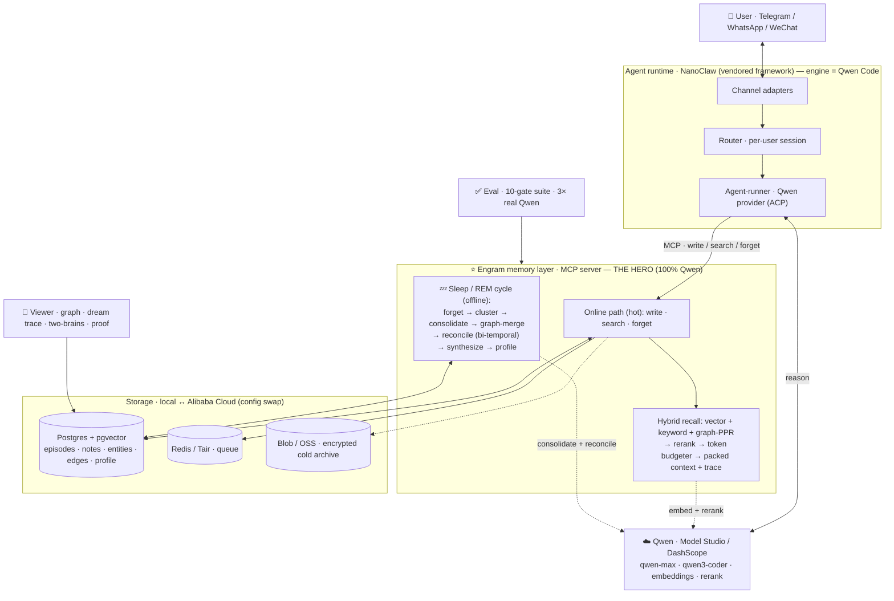

# Engram

**A self-managing memory layer for AI agents — built on Qwen.** Engram captures and
recalls fast while you're active, and during downtime runs a **sleep / REM cycle** that
consolidates raw episodes into durable knowledge, forgets the stale, reconciles
contradictions, and synthesizes new connections — the way sleep consolidates memory in the
brain.

The memory layer is a clean, separable **MCP service**. A Qwen agent (Telegram / WhatsApp)
is the vehicle that shows it off.

> Qwen Cloud Hackathon · Track 1 (MemoryAgent) · MIT

## See it in 60 seconds

```bash
pnpm --filter @engram/viewer start      # brain viewer → http://localhost:8080
```

Hit **▶ Demo**. It self-runs the whole story, no driving needed: teach 3 facts → **Ask
both brains** (Engram answers from memory, a no-memory model shrugs) → 💤 **Dream** (the
graph consolidates) → change a fact → Dream again → ask again: it answers the **new** value,
the old one gone. Or use **Teach Engram** to feed it your own facts and watch.

**Proof** — the memory layer passes a **10-gate eval, 3× on real Qwen, all green**: recall,
*timely forgetting*, *limited-context recall*, contradiction/update resolution, RAG,
no-confabulation, ~200 ms p95. The numbers show live in the viewer's **Proof** panel, or:

```bash
QWEN_MOCK=false DASHSCOPE_API_KEY=sk-... EVAL_RUNS=3 pnpm --filter @engram/eval evals
```

## What's here

```
packages/memory/   ← the hero: memory MCP server (online path) + sleep/REM cycle
packages/shared/   ← infra interfaces + Qwen client (DashScope, behind an interface + offline mock)
packages/viewer/   ← brain viewer: read-only API + React neural-graph UI (Demo Mode, two-brains, proof)
packages/eval/     ← gated eval suite (recall · forgetting · limited-context · contradiction · RAG)
nanoclaw-v2/       ← agent runtime: vendored NanoClaw framework, engine = Qwen Code
deploy/alibaba/    ← config-swap deploy to Alibaba Cloud
```

## The two memory paths

- **Online (fast, cheap):** `memory.write` (episodic capture + embed, idempotent),
  `memory.search` (hybrid recall — vector + keyword + graph-PPR → rerank → a **token
  budgeter** that packs under a budget and exposes its packing trace), `memory.forget`.
- **Sleep / REM (offline, per user):** forget-sweep → cluster → consolidate to semantic
  notes → merge a knowledge graph → reconcile contradictions (bi-temporal) → synthesize →
  rewrite the profile. Checkpointed, cost-bounded, and observable (each cycle emits a report).

Research basis (HippoRAG PPR, Zep/Graphiti bi-temporal, MemGPT/Letta core memory,
Generative-Agents importance): `docs/memory-research-summary.md`.

## Run it

```bash
./engram.sh          # boot docker + build + start the viewer + open the browser
./engram.sh eval     # run the eval, print the report
./engram.sh dream    # force a sleep/REM cycle now
./engram.sh agent    # set up the Telegram / WhatsApp agent (guided)
./engram.sh down     # stop everything (data preserved)
```

Runs offline on a deterministic **mock Qwen** until you add a key. Turn on real Qwen: set
`DASHSCOPE_API_KEY` and `QWEN_MOCK=false` in `.env` (the Qwen client is behind an interface,
so inference + embeddings behave identically local and cloud).

The agent half (`./engram.sh agent`) builds on the vendored NanoClaw runtime (Telegram +
WhatsApp adapters, per-session containers) with the engine on **Qwen Code** and Engram
memory attached over MCP. Full runbook: `docs/agent-and-deploy.md`.

## Deploy to Alibaba

Infra is behind `packages/shared` interfaces — deploying is a config swap
(`ENGRAM_INFRA=alibaba`): AnalyticDB for PostgreSQL, Tair, OSS, Function Compute +
EventBridge (sleep schedule). See `deploy/alibaba/`.

## Architecture



Full detail — the two memory paths, data model, security, multi-tenancy — in
`ARCHITECTURE.md`. Test plan + eval gates in `TESTING.md`.
